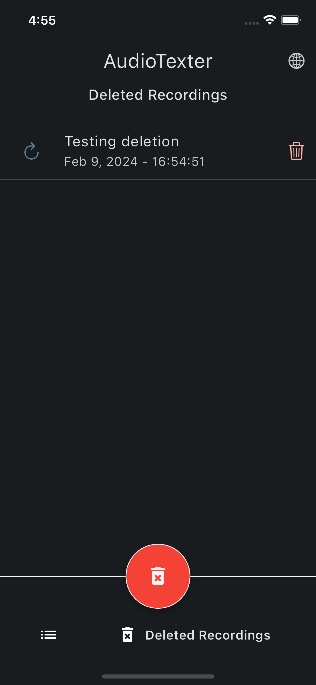

# AudioTexter

 
AudioTexter é um aplicativo desenvolvido em Flutter que permite gravar áudios e transcrevê-los em texto.

## Funcionalidades
- Gravar áudios: Capture facilmente áudios usando o gravador integrado do aplicativo.
- Transcrição de áudio para texto: Os áudios gravados são automaticamente transcritos.
- Correção de transcrição: Todas as transcrições podem ser editadas para corrigir palavras que podem não ter sido entendidas corretamente.
- Armazenamento: Todos os áudios e transcrições são armazenados localmente no dispositivo do usuário.
- Interface intuitiva: O aplicativo possui uma interface de usuário simples e intuitiva, tornando-o fácil de usar para todos.

OBS: Utilize a branch feature/speech_api para usar a api: <a href="https://www.ibm.com/br-pt/products/speech-to-text">**IBM Watson Speech to Text**</a>.

## Contribuições

Contribuições são bem-vindas! Se você encontrar algum problema ou tiver sugestões de melhorias, sinta-se à vontade para abrir uma issue ou enviar um pull request.

## Capturas de tela

### Página inicial

	
    
    

### Página de detalhes

    
    
	

### Dialogs

    
    
	

